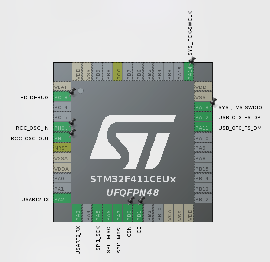

# Biblioteca NRF24L01+ para STM32 com Sistema de Pacotes Customizado para `SSL` e `VSSS`

Esta biblioteca fornece uma interface para comunicação sem fio utilizando o módulo NRF24L01+ com microcontroladores STM32, utilizando a camada HAL da ST. Inclui um sistema para gerenciamento de pacotes customizados, permitindo a transmissão de diferentes tipos de dados estruturados, como comandos para robôs VSSS e SSL.

## Visão Geral

A biblioteca é modularizada em:
* **Camada de Definições (`NRF24_DEF.h`):** Constantes, definições de pinos, registradores do NRF24L01+.
* **Camada de Abstração de Hardware (`NRF24_HAL.c/h`):** Funções de baixo nível para controle de pinos (CE, CSN) e comunicação SPI, utilizando as funções HAL do STM32.
* **Núcleo do Driver NRF24 (`NRF24_CORE.c/h`):** Lógica principal para operar o NRF24L01+, incluindo inicialização, configuração de modos (TX/RX), envio e recepção de dados.
* **Gerenciamento de Pacotes (`COMM_PACKETS.c/h`):** Definição de estruturas de pacotes, tipos de mensagens e funções auxiliares para criar e interpretar pacotes específicos para diferentes aplicações (ex: VSSS, SSL).

## Pré-requisitos

### Hardware
* Microcontrolador STM32 (ex: STM32F411xE, STM32G4xxx, STM32H7xxx)
* Módulo NRF24L01+
* Conexões SPI entre o STM32 e o NRF24L01+ (MOSI, MISO, SCK, CSN)
* Conexões GPIO para os pinos CE do NRF24L01+
* (Opcional) LED para debug visual
* (Opcional) Conversor USB-Serial para `printf` via UART

### Software
* Ambiente de desenvolvimento STM32 (ex: STM32CubeIDE)
* Bibliotecas STM32 HAL
* Compilador C (gnu11 ou similar)

## Estrutura de Arquivos da Biblioteca

Assumindo que os arquivos da biblioteca estão em uma subpasta `Comm` dentro da pasta de includes e fontes do seu projeto (ex: `Core/Inc/Comm/`):

* `Core/Inc/Comm/NRF24_DEF.h`: Definições de hardware, registradores e constantes do NRF24.
* `Core/Inc/Comm/NRF24_HAL.h`: Protótipos para a camada de abstração de hardware.
* `Core/Inc/Comm/NRF24_HAL.c`: Implementações da camada de abstração de hardware.
* `Core/Inc/Comm/NRF24_CORE.h`: Protótipos para o núcleo do driver NRF24.
* `Core/Inc/Comm/NRF24_CORE.c`: Implementações do núcleo do driver NRF24.
* `Core/Inc/Comm/COMM_PACKETS.h`: Definições de tipos de pacotes, subtipos e estruturas de payload.
* `Core/Inc/Comm/COMM_PACKETS.c`: Funções auxiliares para criar pacotes.

## Configuração

### 1. Configuração de Pinos e SPI (`NRF24_DEF.h`)

Edite o arquivo `NRF24_DEF.h` para corresponder à sua configuração de hardware:

```c
// NRF24_DEF.h

// Definições de pinos NRF24 - Adapte conforme sua placa
#include "stm32f4xx_hal.h"

#define NRF24_CE_PORT   GPIOB      // Porta do pino CE (ex: GPIOB)
#define NRF24_CE_PIN    GPIO_PIN_1 // Pino CE (ex: GPIO_PIN_1)

#define NRF24_CSN_PORT  GPIOB      // Porta do pino CSN (ex: GPIOB)
#define NRF24_CSN_PIN   GPIO_PIN_0 // Pino CSN (ex: GPIO_PIN_0)

// Handle SPI (deve ser o mesmo definido e inicializado em main.c)
extern SPI_HandleTypeDef hspi1; // Mude hspi1 se seu handle SPI for diferente
#define NRF24_SPI       &hspi1
```
Importante: Assegure-se de que os pinos CE_Pin e CSN_Pin configurados no CubeMX (e definidos em main.h) correspondem aos NRF24_CE_PIN e NRF24_CSN_PIN em NRF24_DEF.h para a respectiva porta.

### **2. Definição de Pacotes de Comunicação** (`COMM_PACKETS.h`)

Este arquivo é crucial para definir a estrutura dos seus dados.

* `nrf_main_packet_type_t`: 
  Enum para os tipos principais de pacotes (ex: `MAIN_PACKET_TYPE_VSSS_MESSAGE`, `MAIN_PACKET_TYPE_SSL_MESSAGE`).
* Enums de Subtipos: 
  Crie enums como `vsss_command_subtype_t` e `ssl_command_subtype_t` para detalhar os comandos específicos dentro de cada tipo principal de pacote.


```c

// Em COMM_PACKETS.h
typedef enum {
    VSSS_CMD_SUBTYPE_UNDEFINED = 0,
    VSSS_CMD_SET_MOTOR_SPEEDS,
    // adicione outros subtipos VSSS...
} vsss_command_subtype_t;

typedef enum {
    SSL_CMD_SUBTYPE_UNDEFINED = 0,
    SSL_CMD_SET_VELOCITIES,
    SSL_CMD_ACTION_CONTROL,
    // adicione outros subtipos SSL...
} ssl_command_subtype_t;
```

* **Estruturas de Payload**: Defina structs como `vsss_payload_t` e `ssl_payload_t` para conter os dados específicos de cada tipo/subtipo. Use ``` __attribute__((packed))``` para evitar padding.
* `comm_packet_header_t`: 
  Define o cabeçalho comum (tipo principal, número de sequência).
* `comm_packet_t`: A estrutura final do pacote de 32 bytes, com o cabeçalho e uma union para os diferentes payloads.

### **3. Seleção de Nó em `main.c` (DEPRECATED)**

No topo do seu `main.c` (dentro de `/* USER CODE BEGIN 0 */`), defina qual modo o dispositivo operará:

```c

// Em main.c
// Defina UM dos dois para cada placa:
#define TRANSMITTER_NODE  1
// #define RECEIVER_NODE     1
```


## Como Utilizar (`API`) (DEPRECATED)

### **1. Inclusão de Headers**

No seu `main.c` ou em outros arquivos que utilizarão a biblioteca:

```c
#include "Comm/NRF24_CORE.h"
#include "Comm/COMM_PACKETS.h" 
```

### **2. Inicialização do Módulo NRF24** 

```c
// Em main.c, dentro de /* USER CODE BEGIN 2 */
printf("Inicializando NRF24L01+...\r\n");
NRF24_Init();
```

### **3. Configuração do Modo de Operação**

Também em /* USER CODE BEGIN 2 */, configure o modo conforme o nó:

```c
// Variáveis de endereço e canal (definidas em /* USER CODE BEGIN 0 */)
// extern uint8_t nrf_tx_address[5];
// extern uint8_t nrf_rx_pipe1_address[5];
// extern uint8_t NRF_COM_CHANNEL;

#if defined(TRANSMITTER_NODE) && !defined(RECEIVER_NODE)
    printf("Configurado como TRANSMISSOR\r\n");
    NRF24_TxMode(nrf_tx_address, NRF_COM_CHANNEL);
#elif defined(RECEIVER_NODE) && !defined(TRANSMITTER_NODE)
    printf("Configurado como RECEPTOR\r\n");
    NRF24_RxMode(nrf_rx_pipe1_address, nrf_rx_pipe2_lsb, NRF_COM_CHANNEL); // nrf_rx_pipe2_lsb é opcional
#endif
```


### **4. Trabalhando com Pacotes (`COMM_PACKETS.h` e `COMM_PACKETS.c`)**

As funções em COMM_PACKETS.c ajudam a criar pacotes formatados.

* `Comm_Packets_Create_VSSSMessage(comm_packet_t* packet_buffer, uint8_t seq_num, const vsss_payload_t* vsss_payload_data);`
* `Comm_Packets_Create_SSLMessage(comm_packet_t* packet_buffer, uint8_t seq_num, const ssl_payload_t* ssl_payload_data);`
* `Comm_Packets_Create_DebugText(comm_packet_t* packet_buffer, uint8_t seq_num, const char* text_payload);`

### **5. Enviando Dados (Exemplo Transmissor) (DEPRECATED)**

No loop principal do transmissor (`/* USER CODE BEGIN 3 */`):

```c
// Em main.c (bloco TRANSMITTER_NODE)
static comm_packet_t nrf_packet_buffer; // Declarada global estática em PV
static uint8_t packet_seq_counter = 0;  // Declarada global estática em PV

ssl_payload_t ssl_command_data; // Ou vsss_payload_t

// Preencher ssl_command_data ou vsss_data
ssl_command_data.command_subtype = SSL_CMD_SET_VELOCITIES;
ssl_command_data.robot_id = 1;
ssl_command_data.vx = 100;
// ... preencher o resto dos campos ...

// Criar o pacote completo
Comm_Packets_Create_SSLMessage(&nrf_packet_buffer, packet_seq_counter++, &ssl_command_data);

// Transmitir
if (NRF24_Transmit((uint8_t *)&nrf_packet_buffer, sizeof(comm_packet_t))) {
    printf("Pacote SSL enviado! Seq: %d\r\n", nrf_packet_buffer.header.seq_number);
    HAL_GPIO_TogglePin(LED_DEBUG_GPIO_Port, LED_DEBUG_Pin); 
} else {
    printf("Falha ao enviar pacote SSL.\r\n");
}
HAL_Delay(100); // Intervalo entre envios
```

### **6. Recebendo Dados (Exemplo Receptor) (DEPRECATED)** 

 No loop principal do receptor (`/* USER CODE BEGIN 3 */`):

```c

// Em main.c (bloco RECEIVER_NODE)
static comm_packet_t nrf_packet_buffer; // Declarada global estática em PV
uint8_t raw_nrf_input_buffer[NRF_MAX_PACKET_SIZE];

if (isDataAvailable(1)) { // Verifica dados no Pipe 1
    NRF24_Receive(raw_nrf_input_buffer); // Lê 32 bytes brutos

    // Copia para a estrutura de pacote para facilitar o acesso
    memcpy(&nrf_packet_buffer, raw_nrf_input_buffer, sizeof(comm_packet_t));

    HAL_GPIO_TogglePin(LED_DEBUG_GPIO_Port, LED_DEBUG_Pin); // Feedback visual
    printf("Pacote Recebido! Tipo: %d, Seq: %d\r\n",
           nrf_packet_buffer.header.main_type,
           nrf_packet_buffer.header.seq_number);

    switch (nrf_packet_buffer.header.main_type) {
        case MAIN_PACKET_TYPE_SSL_MESSAGE:
        {
            ssl_payload_t* ssl_data = &nrf_packet_buffer.payload_u.ssl_msg;
            printf("  SSL: ID=%d, Subtipo=%d, Vx=%d\r\n",
                   ssl_data->robot_id, ssl_data->command_subtype, ssl_data->vx);
            // Processar dados SSL ...
            break;
        }
        case MAIN_PACKET_TYPE_VSSS_MESSAGE:
        {
            vsss_payload_t* vsss_data = &nrf_packet_buffer.payload_u.vsss_msg;
            printf("  VSSS: ID=%d, Subtipo=%d, M1=%d\r\n",
                   vsss_data->robot_id, vsss_data->command_subtype, vsss_data->motor1_value);
            // Processar dados VSSS ...
            break;
        }
        // Outros cases ...
        default:
            printf("  Tipo de pacote desconhecido: %d\r\n", nrf_packet_buffer.header.main_type);
            break;
    }
}
HAL_Delay(10);
```
### STM32

<p align="center">
  
</p>


## Exemplo no Robô `SSL`
### Transmissor (DEPRECATED):
```c

#include "comm/COMM.h"

uint8_t NRF_TX_ADDRESS[5] = {0xE7, 0xE7, 0xE7, 0xE7, 0xE7};    // Endereço de transmissão
uint8_t NRF_RX_P1_ADDRESS[5] = {0xE7, 0xE7, 0xE7, 0xE7, 0xE7}; // Endereço do Pipe 0 para ACKs no transmissor
uint8_t NRF_CHANNEL_MAIN = 76;                                 // Canal RF

ssl_payload_t ssl_command_data;
uint8_t local_packet_seq_counter = 0;

#ifdef __GNUC__
  #define PUTCHAR_PROTOTYPE int __io_putchar(int ch)
#else
  #define PUTCHAR_PROTOTYPE int fputc(int ch, FILE *f)
#endif

PUTCHAR_PROTOTYPE
{
  HAL_UART_Transmit(&huart2, (uint8_t *)&ch, 1, HAL_MAX_DELAY);
  return ch;
}

int main(void)
{

  printf("\r\n-- Transmissor NRF24 com Camada COMM --\r\n");
  if (!Comm_Init(COMM_ROBOT_TYPE_SSL,
                 COMM_NODE_MODE_TRANSMITTER,
                 NRF_CHANNEL_MAIN,
                 NRF_TX_ADDRESS,
                 NRF_RX_P1_ADDRESS,
                 0 )) {
      printf("Falha ao inicializar módulo de comunicação!\r\n");
      Error_Handler();
  }

  printf("Módulo COMM inicializado como Transmissor SSL.\r\n");


  while (1)
  {
	memset(&ssl_command_data, 0, sizeof(ssl_payload_t));

	ssl_command_data.command_subtype = SSL_CMD_SET_VELOCITIES; // Exemplo de subtipo
	ssl_command_data.robot_id = 1;                             // ID do Robô
	ssl_command_data.vx = (int16_t)(100 + (local_packet_seq_counter % 10) * 5); // Vx: 100, 105, ..., 145, 100...
	ssl_command_data.vy = (int16_t)(20 - (local_packet_seq_counter % 5) * 2);  // Vy: 20, 18, ..., 12, 20...
	ssl_command_data.vw = 0;
	ssl_command_data.referee_command = 0;
	ssl_command_data.kick_front = (local_packet_seq_counter % 15 == 0) ? 1 : 0; // Chuta a cada 15 pacotes
	ssl_command_data.kick_chip = 0;
	ssl_command_data.capacitor_charge = 1; // Mantém carregando
	ssl_command_data.kick_strength = 150;
	ssl_command_data.dribbler_on = (local_packet_seq_counter % 3 == 0) ? 1 : 0;
	ssl_command_data.dribbler_speed = 200;
	ssl_command_data.movement_locked = 0;
	ssl_command_data.critical_move_turbo = 0;


    if (Comm_Send_SSL_Message(&ssl_command_data)) {
        printf("Main: Pacote SSL (ID:%d, Vx:%d) enviado.\r\n",
               ssl_command_data.robot_id, ssl_command_data.vx);
        HAL_GPIO_TogglePin(LED_DEBUG_GPIO_Port, LED_DEBUG_Pin);
    } else {
        printf("Main: Falha ao enviar pacote SSL pela camada Comm.\r\n");
    }

    local_packet_seq_counter++;
  }
}
```
### Receptor (DEPRECATED):
```c
#include "Comm/COMM.h"

uint8_t NRF_RECEIVER_TX_ADDRESS_FOR_ACKS[5] = {0xD7, 0xD7, 0xD7, 0xD7, 0xD7};
uint8_t NRF_RECEIVER_RX_P1_ADDRESS[5] = {0xE7, 0xE7, 0xE7, 0xE7, 0xE7};
uint8_t NRF_RECEIVER_RX_P2_LSB = 0xC3;
uint8_t NRF_COMMON_CHANNEL = 76;

#ifdef __GNUC__
  #define PUTCHAR_PROTOTYPE int __io_putchar(int ch) // Define a macro aqui
#else
  #define PUTCHAR_PROTOTYPE int fputc(int ch, FILE *f)
#endif /* __GNUC__ */

PUTCHAR_PROTOTYPE
{
  HAL_UART_Transmit(&huart2, (uint8_t *)&ch, 1, HAL_MAX_DELAY);
  return ch;
}

void App_HandleSSLData(const ssl_payload_t* ssl_data, uint8_t robot_id, uint8_t seq_num);
void App_HandleVSSSData(const vsss_payload_t* vsss_data, uint8_t robot_id, uint8_t seq_num);
void App_HandleDebugText(const char* text_data, uint8_t seq_num);


void App_HandleSSLData(const ssl_payload_t* ssl_data, uint8_t robot_id, uint8_t seq_num) {
    printf("CALLBACK SSL: ID=%d, Seq=%d -> Subtipo=%d, Vx=%d, Vy=%d, Vw=%d, KickF=%d, Drib=%d, Turbo=%d\r\n",
           robot_id, // robot_id é passado diretamente para o callback
           seq_num,
           ssl_data->command_subtype,
           ssl_data->vx,
           ssl_data->vy,
           ssl_data->vw,
           ssl_data->kick_front,
           ssl_data->dribbler_on,
           ssl_data->critical_move_turbo);
    // Aqui você colocaria a lógica para controlar o robô SSL com base nos dados recebidos
    // Ex: Robot_SSL_ExecuteCommand(robot_id, ssl_data);
    HAL_GPIO_TogglePin(LED_DEBUG_GPIO_Port, LED_DEBUG_Pin); // Pisca LED ao processar
}

void App_HandleVSSSData(const vsss_payload_t* vsss_data, uint8_t robot_id, uint8_t seq_num) {
    printf("CALLBACK VSSS: ID=%d, Seq=%d -> Subtipo=%d, M1=%d, M2=%d, PWM?=%d\r\n",
           robot_id, // robot_id é passado diretamente para o callback
           seq_num,
           vsss_data->command_subtype,
           vsss_data->motor1_value,
           vsss_data->motor2_value,
           vsss_data->is_pwm_flag);
    // Aqui você colocaria a lógica para controlar o robô VSSS
    // Ex: Robot_VSSS_ExecuteCommand(robot_id, vsss_data);
    HAL_GPIO_TogglePin(LED_DEBUG_GPIO_Port, LED_DEBUG_Pin); // Pisca LED ao processar
}

void App_HandleDebugText(const char* text_data, uint8_t seq_num) {
    printf("CALLBACK DEBUG: Seq=%d -> Texto='%s'\r\n", seq_num, text_data);
    HAL_GPIO_TogglePin(LED_DEBUG_GPIO_Port, LED_DEBUG_Pin); // Pisca LED ao processar
}


int main(void)
{

  printf("\r\n-- Receptor NRF24 com Camada COMM --\r\n");

  if (!Comm_Init(COMM_ROBOT_TYPE_UNDEFINED, // Este nó é um receptor genérico ou específico
                 COMM_NODE_MODE_RECEIVER,
                 NRF_COMMON_CHANNEL,
                 NRF_RECEIVER_TX_ADDRESS_FOR_ACKS, // Endereço que o NRF usaria para enviar ACKs (Pipe0)
                 NRF_RECEIVER_RX_P1_ADDRESS,     // Endereço principal de escuta (Pipe1)
                 NRF_RECEIVER_RX_P2_LSB)) {
      printf("Falha ao inicializar módulo de comunicação como Receptor!\r\n");
      Error_Handler();
  }

  Comm_Register_SSL_Packet_Handler(App_HandleSSLData);
  Comm_Register_VSSS_Packet_Handler(App_HandleVSSSData);
  Comm_Register_DebugText_Packet_Handler(App_HandleDebugText);

  printf("Módulo COMM inicializado como Receptor. Aguardando pacotes...\r\n");

  while (1)
  {
	Comm_ProcessReceivedPackets();
	HAL_Delay(1);
}
}
```
